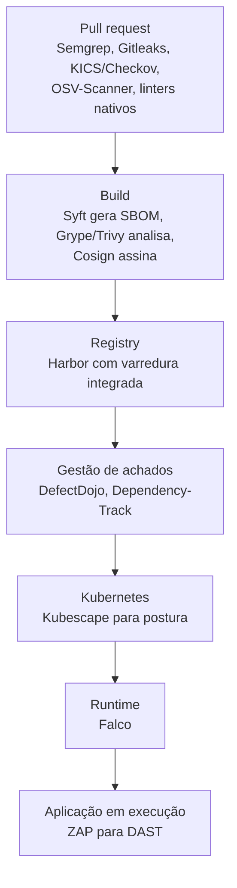

> **Para quem é:** quem precisa de evidência auxiliar de segurança (vulnerabilidades conhecidas, configuração fora do CIS Benchmark) além dos controles preventivos já documentados neste notebook.

Ferramentas de varredura geram evidência auxiliar; elas não substituem privilégio mínimo, isolamento de rede, RBAC e os demais controles preventivos já cobertos em [Policy Enforcement](../../../../learn/security/policy-enforcement/) e nas [checklists de segurança](../../../../operations/checklists/cluster-security/). Um resultado limpo de varredura não comprova que o cluster está seguro, só que os itens verificados não apresentaram os problemas que a ferramenta sabe procurar.

## Trivy: varredura de vulnerabilidades, Secrets e configuração

Trivy varre imagens de container, sistemas de arquivos, repositórios Git e manifests Kubernetes/Terraform em busca de vulnerabilidades conhecidas (CVEs), Secrets expostos no código e configurações inseguras, comparando o que encontra contra bancos de dados de vulnerabilidades atualizados continuamente.

```bash
sudo apt install wget gnupg
wget -qO - https://aquasecurity.github.io/trivy-repo/deb/public.key | gpg --dearmor | sudo tee /usr/share/keyrings/trivy.gpg > /dev/null
echo "deb [signed-by=/usr/share/keyrings/trivy.gpg] https://aquasecurity.github.io/trivy-repo/deb $(lsb_release -sc) main" | sudo tee /etc/apt/sources.list.d/trivy.list

sudo apt update
sudo apt install trivy
```

```bash
# Varrer uma imagem
trivy image nginx:1.27

# Varrer manifests Kubernetes em um diretório, procurando configuração insegura
trivy config ./manifests/

# Varrer um cluster já em execução (requer kubeconfig com permissão de leitura ampla)
trivy k8s --report summary cluster
```

**Quando usar:** antes de publicar uma imagem construída internamente, para confirmar que não carrega vulnerabilidades já conhecidas nas camadas base; em CI, como gate antes do deploy; ou periodicamente contra o cluster já em execução, para detectar quando uma vulnerabilidade nova foi divulgada para algo que já está rodando havia tempo.

**Modelo de acesso e privilégios:** a varredura de imagem e de filesystem não exige privilégio especial além de ler a imagem ou os arquivos analisados. `trivy k8s` é o modo mais sensível: precisa de um kubeconfig com permissão de leitura sobre os recursos que vai inspecionar (Pods, Secrets, ConfigMaps, RBAC), o que, dependendo do escopo concedido, já é acesso equivalente a um leitor administrativo do cluster.

**Riscos:** o banco de dados de vulnerabilidades precisa ser atualizado continuamente (Trivy baixa atualizações automaticamente por padrão); uma execução offline ou com cache desatualizado pode reportar "nenhuma vulnerabilidade encontrada" apenas porque não conhece as mais recentes, não porque a imagem esteja de fato livre delas. Trate um resultado limpo como "nada encontrado nesta data, com este banco de dados", não como uma garantia permanente.

## kube-bench: verificação contra o CIS Kubernetes Benchmark

kube-bench executa os testes automatizáveis do CIS Kubernetes Benchmark (um conjunto de recomendações de configuração publicado pelo Center for Internet Security) contra os componentes do cluster: permissões de arquivos de configuração, flags do `kubelet`, do `kube-apiserver` e demais componentes do control plane, reportando cada item como `PASS`, `FAIL` ou `WARN`.

```bash
# Como Job no cluster, a forma mais comum: monta os diretórios de configuração
# do nó dentro do container para o kube-bench inspecionar
kubectl apply -f https://raw.githubusercontent.com/aquasecurity/kube-bench/main/job.yaml
kubectl logs job.batch/kube-bench
```

**Quando usar:** auditoria periódica de configuração do cluster, ou checagem pontual antes de um processo de certificação/compliance que exige evidência de aderência ao CIS Benchmark.

**Modelo de acesso e privilégios:** o Job oficial monta diretórios do host (`/etc/kubernetes`, `/var/lib/kubelet`, entre outros) como volumes `hostPath` dentro do Pod, para ler arquivos de configuração que só existem no filesystem do nó; isso exige que o Pod rode com privilégios suficientes para montar esses caminhos, o equivalente a acesso de leitura ao filesystem do nó. Revise o manifesto antes de aplicá-lo em um cluster com política de segurança restritiva (Pod Security Admission em `restricted`, por exemplo), porque ele não passa nesse nível por padrão.

**Riscos:** nem todo controle do CIS Benchmark genérico se aplica do mesmo jeito a uma distribuição como K3s, que já toma decisões diferentes do Kubernetes upstream em vários desses itens (arquivos de configuração em caminhos diferentes, componentes embarcados em um único binário). Um `FAIL` precisa ser confirmado manualmente contra a documentação do K3s antes de virar uma correção; aplicar a recomendação genérica sem essa checagem pode quebrar um comportamento que o K3s espera.

## Kubescape

Kubescape avalia postura e configuração de workloads e clusters contra frameworks como NSA/CISA, MITRE ATT&CK for Containers e CIS Kubernetes Benchmark. O modelo mental completo (o que ele analisa, o que um compliance score significa, por que scanner não é enforcement) está em [Kubescape: modelo mental, não lista de comandos](../../../../learn/security/kubescape/); o procedimento de varredura contra um cluster real, leitura de resultado e exceções documentadas está em [varrer um cluster com Kubescape](../../../../guides/tasks/security/scan-cluster-with-kubescape/).

## Segurança de código-fonte e supply chain de aplicação

As ferramentas desta seção não são de infraestrutura: elas analisam código-fonte e dependências de aplicação, um domínio diferente do restante deste catálogo (que cobre hosts, containers e clusters). Ficam registradas aqui porque o time que opera a infraestrutura costuma ser o mesmo que decide o pipeline de CI, mas nenhuma delas substitui Trivy/kube-bench nem é substituída por eles: Trivy varre a imagem já construída; as ferramentas abaixo atuam antes disso, no código e nas dependências que formam essa imagem.

Plataformas comerciais como Socket, SonarQube, Snyk, JFrog e CodeQL não são equivalentes entre si nem substituíveis por uma única ferramenta open source: cada uma cobre uma fatia diferente do ciclo (comportamento de pacote, qualidade de código, dependências, distribuição de artefatos, análise semântica). No mundo open source, aproximar o que uma dessas plataformas oferece geralmente exige compor várias ferramentas especializadas, não trocar uma pela outra.

| Plataforma comercial | Alternativas open source mais relevantes | Cobre o quê |
| --- | --- | --- |
| Socket | GuardDog, Packj, OpenSSF Scorecard, OpenSSF Package Analysis, OSV-Scanner | Dependências maliciosas, typosquatting, manutenção do projeto, comportamento suspeito |
| SonarQube / SonarCloud | Semgrep CE, MegaLinter, linters específicos por linguagem | Semgrep cobre segurança; MegaLinter e linters cobrem qualidade e consistência |
| Snyk | Trivy, Grype, Syft, OSV-Scanner, Dependency-Track, KICS ou Checkov, Gitleaks | Exige combinar SCA, containers, IaC, SBOM e segredos |
| JFrog Artifactory/Xray | Harbor, Pulp, Zot, Nexus Repository (Community), Trivy ou Grype, Dependency-Track | Harbor é forte em OCI; Pulp e Nexus atendem melhor múltiplos formatos de pacote |
| CodeQL | Joern, Semgrep CE, analisadores específicos (ex.: `gosec` para Go) | Joern é o mais próximo conceitualmente; Semgrep é mais simples de operar |

### SAST (análise estática de código)

SonarQube analisa código-fonte em busca de bugs, vulnerabilidades e "code smells", com a Community Edition open source (autogerenciada, hoje distribuída como SonarQube Community Build) cobrindo um conjunto amplo de linguagens, e edições pagas (Developer, Enterprise, ou a versão SaaS SonarQube Cloud) adicionando regras de segurança mais profundas e recursos de governança entre equipes. CodeQL é o motor de análise semântica de código do GitHub: trata o código como dados consultáveis (uma "linguagem de consulta" sobre o código), permitindo escrever ou reutilizar consultas que encontram padrões de vulnerabilidade específicos. Como parte do GitHub code scanning, o CodeQL roda gratuitamente em repositórios públicos; em repositórios privados, exige GitHub Advanced Security (recurso pago). O CLI e as bibliotecas de consultas padrão do CodeQL também podem ser usados fora do GitHub, de forma independente.

**Alternativas open source:** Semgrep (núcleo com licença aberta, regras próprias e comunitárias) cobre boa parte do caso de uso de ambas sem depender de uma plataforma paga para rodar localmente ou em qualquer CI; os recursos adicionais de correlação entre repositórios e priorização (Semgrep Supply Chain/AppSec) são pagos, mas o motor de varredura em si roda de graça, autogerenciado. Joern é o concorrente conceitualmente mais próximo do CodeQL: constrói um Code Property Graph (combinando AST, fluxo de controle e fluxo de dados) e permite consultas sobre esse grafo, adequado para análise de fluxo de dados entre funções, variant analysis e pesquisa de vulnerabilidades; a maturidade do suporte varia por linguagem, e a complexidade de operar e escrever consultas é maior que a do Semgrep. Para a parte de qualidade e consistência que o SonarQube também cobre (não só segurança), MegaLinter não é um analisador próprio: orquestra dezenas de linters, formatadores e validadores já existentes para código, IaC e documentação em um único pipeline. Analisadores específicos de linguagem complementam esse conjunto; para Go, por exemplo, `golangci-lint` agrega vários analisadores (`errcheck`, `govet`, `staticcheck`, `ineffassign`, entre outros) e `gosec` foca em padrões de vulnerabilidade (SQL injection, command injection, SSRF, path traversal) usando análise de AST e fluxo. Nenhuma composição open source reproduz sozinha tudo que o SonarQube oferece (dívida técnica, histórico, quality gates, dashback centralizado); uma composição razoável é MegaLinter ou linters nativos, mais Semgrep CE para segurança, mais cobertura de testes e publicação de resultados em formato SARIF no GitHub/GitLab.

### Varredura de dependências e supply chain

Snyk varre dependências declaradas (bibliotecas de linguagens como npm, PyPI, Maven), imagens de container e Infrastructure as Code, cruzando com um banco de vulnerabilidades próprio; é um serviço SaaS comercial com um nível gratuito limitado. socket.dev cobre um problema mais específico que uma lista de CVEs conhecidas: análise comportamental de pacotes de código aberto para detectar sinais de ataque à cadeia de suprimentos (scripts de instalação suspeitos, ofuscação, typosquatting, mudança repentina de mantenedor), o tipo de ataque que compromete um pacote legítimo sem que uma CVE tenha sido registrada ainda.

**Alternativas open source para o problema do socket.dev (comportamento malicioso, não apenas CVE):** GuardDog analisa código e metadados de pacotes npm, PyPI, módulos Go, RubyGems, GitHub Actions e extensões do VS Code com regras YARA e heurísticas voltadas a ataques de supply chain, uma das opções mais diretas para esse caso específico. Packj procura pacotes vulneráveis, abandonados, maliciosos, com typosquatting ou starjacking, e se encaixa bem como checagem antes de adicionar uma dependência nova ao projeto. OpenSSF Scorecard não detecta malware diretamente: avalia a postura de segurança do projeto mantenedor (proteção de branches, revisão de código, dependências fixadas, releases assinadas, CI perigoso), respondendo "este projeto parece confiável e bem mantido?", uma pergunta que um scanner de CVE tradicional não responde. OpenSSF Package Analysis executa análise de comportamento de pacotes publicados sobre uma infraestrutura aberta; é mais uma base técnica e de pesquisa do que um produto com a mesma experiência de uso do socket.dev. Não existe hoje uma única alternativa open source madura que replique exatamente a detecção comportamental do socket.dev; a composição mais próxima combina GuardDog e Packj (risco e comportamento suspeito do pacote em si), Scorecard (postura do projeto mantenedor) e OSV-Scanner (vulnerabilidades já conhecidas, usando a base aberta OSV.dev, com suporte a vários ecossistemas, lockfiles e código C/C++ vendorizado).

**Alternativas open source para o restante do escopo do Snyk:** Trivy, já catalogado acima, também varre dependências de aplicação (`trivy fs`), não só imagens de container, sendo provavelmente a ferramenta individual com maior cobertura isolada (repositórios, lockfiles, imagens, filesystems, hosts, Kubernetes, vulnerabilidades, configuração incorreta e segredos, tudo no mesmo binário). Grype e Syft trabalham em par: Syft gera um SBOM (inventário detalhado de componentes) de imagens, filesystems ou repositórios, e Grype consome imagens, diretórios ou o SBOM já gerado para encontrar vulnerabilidades conhecidas; separar inventário de análise torna essa dupla particularmente útil em pipelines auditáveis, onde o SBOM em si é um artefato a preservar, não só um passo intermediário. Dependency-Track é o componente persistente dessa arquitetura: recebe SBOMs no formato CycloneDX, mantém um inventário contínuo dos componentes, reavalia vulnerabilidades conforme novas são publicadas (sem precisar rodar uma nova varredura completa) e aplica políticas configuráveis. Gitleaks é um scanner de segredos especializado (chaves, tokens, credenciais) em histórico Git, diretórios e arquivos, simples de rodar em pre-commit e CI, com licença MIT. KICS e Checkov cobrem configuração incorreta em Terraform, Kubernetes, Helm, Dockerfile e CloudFormation, entre outros formatos de IaC; KICS também declara suporte a Ansible, Pulumi, Crossplane, OpenAPI e Serverless, com um conjunto grande de queries baseadas em Rego (a mesma linguagem de política do OPA), enquanto Checkov tem um ecossistema maior e integração mais madura com Terraform e provedores de nuvem. Adotar os dois ao mesmo tempo tende a gerar sobreposição sem ganho proporcional; comece por um.

### Registries e repositórios de artefatos (equivalentes ao JFrog Artifactory/Xray)

JFrog Artifactory (repositório universal de pacotes) e Xray (varredura de segurança integrada) não têm um substituto único open source com a mesma amplitude de formatos suportados. Harbor é a opção mais adequada quando o foco é OCI (imagens de container, charts Helm) e Kubernetes: oferece RBAC, políticas, replicação entre registries, varredura de vulnerabilidades (via integração com Trivy) e assinatura de artefatos, e é um projeto graduado da CNCF; a limitação é não ser um substituto universal do Artifactory para Maven, npm, NuGet, PyPI, Debian, RPM e as dezenas de outros formatos que o Artifactory suporta nativamente. Pulp é uma plataforma totalmente open source para espelhar, armazenar, organizar e distribuir múltiplos tipos de pacote através de um sistema de plugins por ecossistema, mais próxima de um framework de repositórios do que de um produto monolítico. Zot é um registry OCI mais leve e simples que o Harbor, adequado para homelab, edge ou clusters pequenos que não precisam dos dashboards e componentes adicionais do Harbor. Nexus Repository, na edição Community, continua sendo uma opção de repositório multi-formato, mas é a edição comunitária de um produto open-core: não oferece de graça tudo que seria necessário para substituir Artifactory e Xray juntos. A composição mais próxima do conjunto JFrog é Harbor ou Pulp para o repositório em si, combinado com Trivy ou Grype para varredura, Syft para SBOM e Cosign para assinatura de artefatos. Para o panorama completo de registries (incluindo SaaS, serviços gerenciados por nuvem e a comparação entre Harbor, Zot, CNCF Distribution e as demais opções self-hosted, com critérios de escolha), veja [registries de containers](../../../../learn/containers/container-registries/).

### Proveniência de build

GitHub Artifact Attestations gera uma atestação de proveniência assinada para um artefato produzido em um workflow do GitHub Actions, registrando de qual repositório, commit e workflow o artefato veio. Por baixo, usa a mesma infraestrutura Sigstore/cosign já tratada em [verificar a proveniência de uma imagem ou artefato assinado](../../../commands/cryptography/#verificar-a-proveniência-de-uma-imagem-ou-artefato-assinado-cosign); a diferença é que o GitHub gera e publica a atestação automaticamente como parte do workflow (`actions/attest-build-provenance`), em vez de exigir configuração manual do processo de assinatura. A verificação do lado de quem consome o artefato pode ser feita tanto pelo `cosign verify-attestation` já documentado quanto pelo `gh attestation verify`, específico do GitHub.

### Complementos que nenhuma das plataformas acima cobre sozinha

Três categorias ficam fora do que scanners de CVE e SAST resolvem, mesmo combinados. DefectDojo centraliza, normaliza, deduplica e acompanha o histórico de achados vindos de dezenas de scanners diferentes; ele não substitui nenhum scanner, funciona como camada de gestão de vulnerabilidades e ASPM (application security posture management), recebendo relatórios em SARIF ou formatos equivalentes. A diferença para o Dependency-Track já citado é de escopo: Dependency-Track cuida de componentes, SBOMs e supply chain; DefectDojo cuida dos achados que múltiplos scanners (SAST, SCA, DAST, varredura de infraestrutura) produzem; os dois costumam ser usados juntos, não um no lugar do outro. Falco adiciona a camada de runtime que nenhuma ferramenta estática cobre: observa eventos do kernel, containers e Kubernetes em tempo real e gera alertas diante de comportamento suspeito depois que algo já está em execução, o mesmo tipo de sinal que [detectar comportamento suspeito em runtime](../../overview/#diagnóstico-segurança-e-recuperação) já cita na tabela geral deste catálogo. OWASP ZAP adiciona DAST (Dynamic Application Security Testing): em vez de analisar código-fonte, ataca a aplicação já em execução como um cliente HTTP faria, com varredura passiva e ativa e automação a partir de uma especificação OpenAPI, cobrindo uma classe de problema (comportamento observável só em runtime, como configuração de CORS ou cabeçalhos de segurança ausentes) que SAST e SCA não alcançam.

Uma composição progressiva razoável, para quem está partindo do zero, prioriza primeiro o que tem menor custo de adoção: Semgrep, Gitleaks, Trivy (ou OSV-Scanner), um dos dois scanners de IaC (KICS ou Checkov) e os linters nativos da linguagem já cobrem a maior parte do risco com o menor esforço de operação. Supply chain (Syft, Dependency-Track, Cosign) e a camada de registry/gestão (Harbor, DefectDojo) vêm depois, quando o volume de achados já justifica uma camada de agregação. Runtime (Falco) e DAST (ZAP) fecham a cobertura por último, porque dependem de a aplicação já estar rodando em um ambiente representativo. Em qualquer estágio, evite rodar duas ferramentas com escopo muito sobreposto ao mesmo tempo (dois scanners de dependência, dois de IaC): escolha uma como principal e reserve a segunda para projetos específicos onde a cobertura adicional compensa o custo de manter as duas.



Este fluxo é apenas ilustrativo, uma forma de visualizar onde cada categoria de ferramenta atua; não é a stack usada por este notebook, cujo escopo permanece infraestrutura (hosts, K3s, GitOps, segredos, observabilidade), não segurança de aplicação.

## Referências

- [Trivy — documentação oficial](https://trivy.dev/): instalação por gerenciador de pacotes, modos de varredura e integração com CI.
- [kube-bench — repositório oficial](https://github.com/aquasecurity/kube-bench): manifests de Job prontos, formatos de saída e mapeamento de controles do CIS Benchmark.
- [CIS Kubernetes Benchmark](https://www.cisecurity.org/benchmark/kubernetes): documento de referência com a numeração de controles que o kube-bench verifica.
- [OpenSSF Scorecard](https://github.com/ossf/scorecard): critérios de avaliação de postura de segurança de um projeto open source.
- [OSV-Scanner](https://google.github.io/osv-scanner/): ecossistemas e formatos de lockfile suportados.
- [Syft](https://github.com/anchore/syft) e [Grype](https://github.com/anchore/grype): geração de SBOM e varredura de vulnerabilidades a partir dele.
- [Dependency-Track](https://docs.dependencytrack.org/): arquitetura, ingestão de SBOM CycloneDX e motor de políticas.
- [Gitleaks](https://github.com/gitleaks/gitleaks): regras de detecção de segredos e integração com pre-commit.
- [Harbor](https://goharbor.io/docs/): documentação oficial do projeto CNCF.
- [Joern](https://docs.joern.io/): Code Property Graph e linguagem de consulta.
- [DefectDojo](https://docs.defectdojo.com/): integrações suportadas e modelo de deduplicação de achados.
- [Falco](https://falco.org/docs/): fontes de eventos e regras de detecção em runtime.
- [OWASP ZAP](https://www.zaproxy.org/docs/): modos de varredura e automação via OpenAPI.
